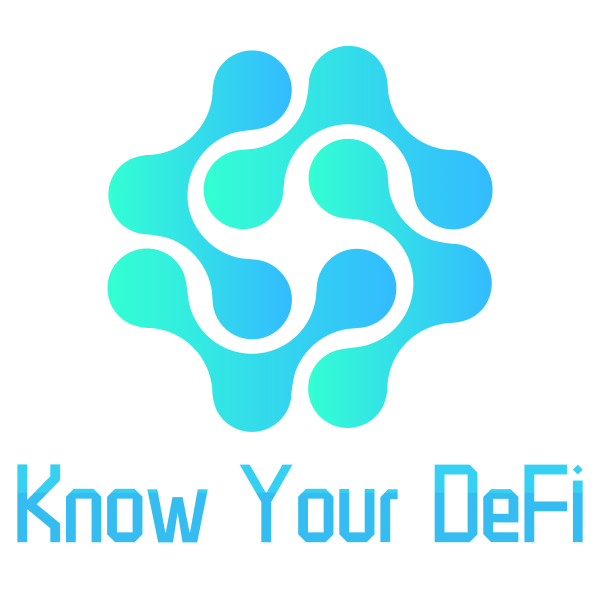

	
	 
	 

	<b>A strategy and data platform for Decentralized Finance</b>

	💫 <a href="https://www.knowyourdefi.com/">knowyourdefi.com</a>
	🌱 <a href="https://twitter.com/rhizomedaot">@RhizomeDAO</a>

## About
We believe that every DeFi project has its core features that set it apart from other projects. Only by understanding these core characteristics can users know the risks and make the right decisions. To truly help users adjust their DeFi strategies, it is best to provide customized data query services based on professional research and accurate, fast data sources.

## Example: Liquity
Know Your DeFi was built for the [ETHGlobal](https://ethglobal.co/) HackMoney 2021 hackathon. 
In this hackathon, we focused on Liquity, a decentralized lending protocol that allows users to borrow LUSD against ETH at 0% interest.
Liquity has many innovative features, such as a minimum collateral ratio of 110%, efficient liquidations, decentralized front-ends and governance free. Users who understand the core mechanics of Liquity will be able to participate more safely and arbitrage during extreme market conditions.

Although some data pages have been built on Dune, users have to do a lot of research on their own to take advantage of these unclassified data due to the limitations of the Dune platform; moreover, the existing data platform is not comprehensive and lacks risk tips, making it difficult for users to meet their arbitrage needs during extreme market conditions and to know whether their Trove is risky or not, which is very unfriendly for DeFi newbies

Know Your DeFi's solution is to select more reliable data sources, such as subgraphs from The Graph, to add strategy descriptions and risk tips to some of the data modules based on professional research findings, and to visualize the most critical risk tips. In this way, the value of the data to the user will be maximized.

## Plan
Ideally, we might be able to incorporate more researchers and developers in the form of a DAO or distributed organization, thus optimizing and adding data query tools for users to better understand more projects in the DeFi ecosystem.
